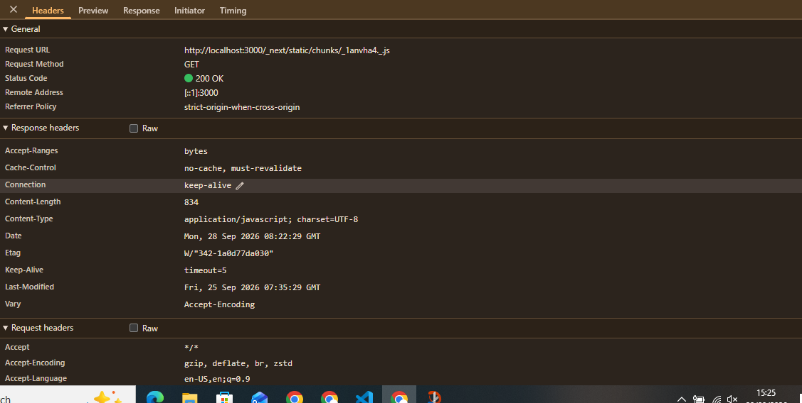
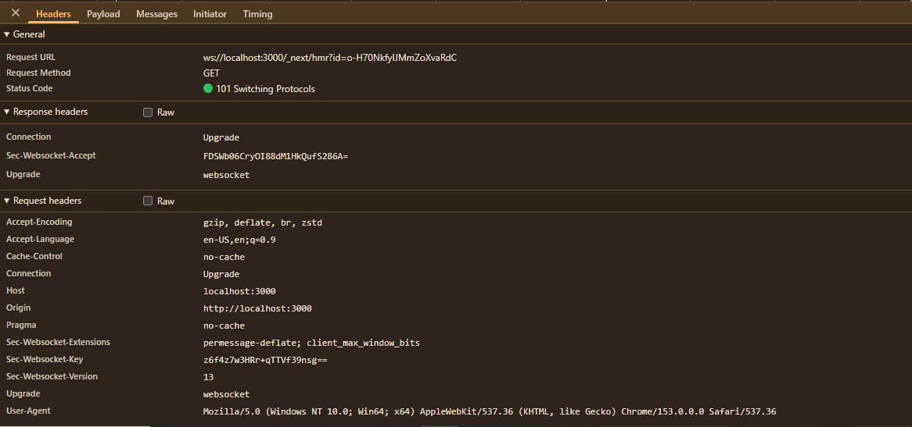

# Dokumen Teknis Modul 1 — Lingkungan Pengembangan, Git, dan Lalu Lintas HTTP

**Nama:** Wisnu Bimantoro  
**NIM:** 105224045  
**Repositori:** [Praktikum-Pemweb-Wisnu-Modul1](https://github.com/wsnubmntr/Praktikum-Pemweb-Wisnu-Modul1)  
**Platform:** GitHub (`wsnubmntr`)

---

## 1. Lingkungan Pengembangan

Praktikum Modul 1 menggunakan lingkungan pengembangan berbasis Windows dengan editor Visual Studio Code, runtime Node.js, package manager npm, version control system Git, serta framework Next.js berbasis TypeScript.

### 1.1 Versi Perangkat Lunak

| Komponen | Versi | Keterangan / Fungsi |
|---|---|---|
| Sistem Operasi | Windows 10/11 x64 | Host environment pengembangan |
| Node.js | v26.9.0 | Runtime JavaScript di sisi server |
| npm | 11.19.1 | Package manager & runner script |
| Git | 2.55.0.windows.3 | Version control system |
| Visual Studio Code | 1.139.0 | Code editor utama |
| Framework | Next.js 16.3.6 | Full-stack React framework |
| Bahasa Pemrograman | TypeScript 5.x | Superset JavaScript dengan static typing |

### 1.2 Konfigurasi Git

Konfigurasi identitas global Git yang digunakan:

```text
user.name=Wisnu Bimantoro
user.email=nuuu008@gmail.com
```

Konfigurasi ini memastikan setiap commit yang dibuat teratribusi dengan identitas mahasiswa pada repository.

### 1.3 Struktur Awal Project

Project diinisialisasi menggunakan Next.js dengan TypeScript dan Tailwind CSS v4. Struktur direktori project adalah sebagai berikut:

```text
Praktikum-Pemweb-Wisnu-Modul1/
├── app/                  # Routing dan komponen antarmuka Next.js App Router
├── docs/                 # Dokumentasi teknis dan modul praktikum
│   └── praktikum/
├── public/               # File dan aset statis (gambar, icon, svg)
├── node_modules/         # Direktori dependensi proyek (npm)
├── .gitignore            # Daftar file/folder yang diabaikan Git
├── package.json          # Metadata proyek, dependencies, dan scripts
├── package-lock.json     # Catatan versi dependensi terkunci (lockfile)
├── tsconfig.json         # Konfigurasi compiler TypeScript
└── README.md             # Dokumentasi ringkas proyek
```

Project dijalankan di lingkungan lokal dengan perintah:

```bash
npm run dev
```

Aplikasi dapat diakses melalui browser pada alamat:

```text
http://localhost:3000
```

---

## 2. Alur Kerja Git

Git digunakan untuk version control, mencatat riwayat perubahan secara berkala, dan menghubungkan repository lokal dengan repository remote di GitHub.

### 2.1 Pemeriksaan Status Repository

Pemeriksaan status working tree dilakukan menggunakan:

```bash
git status
```

Perintah ini memverifikasi file yang telah diubah, untracked files, serta file yang berada pada staging area sebelum di-commit.

### 2.2 Riwayat Commit

Pemeriksaan log commit dilakukan menggunakan:

```bash
git log --oneline --graph
```

Output:

```text
* 29c5939 (HEAD -> main, origin/main, origin/HEAD) Initialize week-1 project with Next.js, TypeScript, and Tailwind CSS setup
```

Commit awal tercatat pada hash `29c5939`. Posisi `HEAD -> main` dan `origin/main` yang sejajar menunjukkan bahwa branch `main` lokal telah tersinkronisasi penuh dengan remote GitHub.

### 2.3 Integrasi Repository Remote dan Pull Request

- **Remote URL:** `https://github.com/wsnubmntr/Praktikum-Pemweb-Wisnu-Modul1.git`
- **Username:** `wsnubmntr`
- **Mekanisme Kolaborasi:** Menggunakan fitur Pull Request di GitHub untuk meninjau perubahan sebelum digabungkan ke branch utama (`main`).
- **Status Integrasi:** Seluruh proses sinkronisasi dan penggabungan branch berjalan mulus tanpa konflik merge (tidak memicu marker konflik seperti `<<<<<<< HEAD`).

---

## 3. Pengamatan Lalu Lintas HTTP

Pengamatan lalu lintas HTTP dilakukan menggunakan **Chrome DevTools (tab Network)** dan CLI **curl.exe** melalui Windows PowerShell untuk mengamati struktur request/response, HTTP method, status code, serta header.

### 3.1 Pengamatan Request JavaScript (Localhost)

Pengamatan dilakukan pada pemanggilan resource JavaScript dari server development Next.js:

| Parameter | Nilai Pengamatan |
|---|---|
| Request URL | `http://localhost:3000/_next/static/chunks/_1anvha4_..js` |
| Request Method | `GET` |
| Status Code | `200 OK` |
| Remote Address | `[::1]:3000` |
| Content-Type | `application/javascript; charset=UTF-8` |
| Cache-Control | `no-cache, must-revalidate` |
| Content-Length | `834` |
| Connection | `keep-alive` |

**Analisis:**
- Metode `GET` digunakan browser untuk mengambil aset script chunk.
- Status `200 OK` menunjukkan asset berhasil disajikan oleh server lokal.
- Header `Cache-Control: no-cache, must-revalidate` memastikan browser memvalidasi ulang script ke server Next.js setiap ada perubahan.



### 3.2 Pengamatan WebSocket Next.js (HMR)

Pada mode development, Next.js membuka koneksi WebSocket untuk fitur *Hot Module Replacement* (HMR):

| Parameter | Nilai Pengamatan |
|---|---|
| Request URL | `ws://localhost:3000/_next/hmr?id=o-H70NkfyIJMmZoXvaRdC` |
| Request Method | `GET` |
| Status Code | `101 Switching Protocols` |
| Connection | `Upgrade` |
| Upgrade | `websocket` |
| Origin | `http://localhost:3000` |

**Analisis:**
- Status `101 Switching Protocols` menandakan persetujuan server untuk melakukan upgrade protokol komunikasi dari HTTP/1.1 menjadi protokol dupleks WebSocket.
- Melalui WebSocket HMR, perubahan kode langsung direfleksikan ke browser tanpa perlu me-reload halaman secara manual.



### 3.3 Pengamatan HTTP Menggunakan CLI `curl.exe`

Pengamatan baris perintah pada PowerShell menggunakan `curl.exe` menghasilkan data berikut:

#### 3.3.1 `curl.exe -I http://localhost:3000`

```text
HTTP/1.1 200 OK
Vary: rsc, next-router-state-tree, next-router-prefetch, next-router-segment-prefetch, Accept-Encoding
Link: </_next/static/media/797e433ab948586e-s.p.0r6juujl39pe6.woff2>; rel=preload; as="font"; crossorigin=""; type="font/woff2", </_next/static/media/caa3a2e1cccd8315-s.p.0wgildi0cnwt9.woff2>; rel=preload; as="font"; crossorigin=""; type="font/woff2"
Cache-Control: no-cache, must-revalidate
Content-Type: text/html; charset=utf-8
Date: Mon, 28 Sep 2026 08:30:14 GMT
Connection: keep-alive
Keep-Alive: timeout=5
```

- Parameter `-I` mengirimkan request dengan HTTP Method **HEAD** (hanya mengambil response headers tanpa body response).
- Server mengembalikan `Content-Type: text/html; charset=utf-8` yang mengindikasikan halaman utama aplikasi berupa dokumen HTML.

#### 3.3.2 `curl.exe -I http://github.com`

```text
HTTP/1.1 301 Moved Permanently
Content-Length: 0
Location: https://github.com/
```

- Status `301 Moved Permanently` bersama header `Location: https://github.com/` menunjukkan pengalihan rute permanen dari protokol HTTP (tidak terenkripsi) ke HTTPS (terenkripsi).

#### 3.3.3 `curl.exe -v https://example.com`

```text
* Host example.com:443 was resolved.
* IPv4: 104.20.23.154, 172.66.147.243
* Connected to example.com (104.20.23.154) port 443
* using HTTP/1.x

> GET / HTTP/1.1
> Host: example.com
> User-Agent: curl/8.13.0
> Accept: */*

< HTTP/1.1 200 OK
< Date: Mon, 28 Sep 2026 08:30:39 GMT
< Content-Type: text/html
< Transfer-Encoding: chunked
< Connection: keep-alive
< Server: cloudflare
< last-modified: Sat, 26 Sep 2026 09:09:07 GMT
< allow: GET, HEAD
< Accept-Ranges: bytes
< Age: 1
< cf-cache-status: HIT
< CF-RAY: a42163269b6afe07-SIN
```

- Parameter `-v` (*verbose*) menampilkan handshake SSL/TLS, request headers (`GET / HTTP/1.1`), dan response headers.
- Header `Server: cloudflare` dan `cf-cache-status: HIT` membuktikan response dilayani langsung dari cache edge server CDN Cloudflare tanpa membebani origin server.

---

### 3.4 Lembar Kerja Ringkasan Pengamatan HTTP

| No. | URL / Resource Target | Method | Status Code | Content-Type | Header Kunci |
|:---:|---|:---:|:---:|---|---|
| 1 | `http://localhost:3000/_next/static/chunks/_1anvha4_..js` | GET | 200 OK | application/javascript; charset=UTF-8 | `Cache-Control: no-cache, must-revalidate` |
| 2 | `ws://localhost:3000/_next/hmr?...` | GET | 101 Switching Protocols | - | `Connection: Upgrade`, `Upgrade: websocket` |
| 3 | `http://localhost:3000` | HEAD | 200 OK | text/html; charset=utf-8 | `Cache-Control: no-cache`, `Connection: keep-alive` |
| 4 | `http://github.com` | HEAD | 301 Moved Permanently | - | `Location: https://github.com/` |
| 5 | `https://example.com` | GET | 200 OK | text/html | `Server: cloudflare`, `cf-cache-status: HIT` |

---

### 3.5 Analisis Teknis

1. **Perbedaan Metode GET dan HEAD:**
   - **GET:** Digunakan untuk meminta representasi resource secara lengkap, mengembalikan header beserta body response (dokumen HTML atau payload skrip JS).
   - **HEAD:** Mengirimkan permintaan yang identik dengan GET namun server hanya mengembalikan baris status dan header tanpa payload data (body). Digunakan oleh `curl -I` untuk memeriksa keberadaan file, status redirect, atau metadata cache secara efisien.
2. **Perilaku Kode Status:**
   - **`200 OK`:** Permintaan berhasil dan resource tersedia.
   - **`101 Switching Protocols`:** Server menyetujui pergantian protokol komunikasi dua arah (WebSocket).
   - **`301 Moved Permanently`:** Pengalihan URL permanen (ke HTTPS), browser/client wajib mengikuti header `Location`.
3. **Mekanisme Caching:**
   - Pada localhost Next.js, `Cache-Control: no-cache, must-revalidate` mencegah browser menggunakan stale chunk sehingga developer selalu melihat versi kode teraktual.
   - Pada `example.com`, status `cf-cache-status: HIT` menunjukkan efisiensi CDN dalam melayani request berulang dari cache edge server.

---

## 4. Kendala dan Penyelesaian

### 4.1 Kendala
Pada awal praktikum, terdapat sedikit kebingungan dalam memahami sinkronisasi alur Git—khususnya keterkaitan antara repository lokal, status staging, commit hash, serta sinkronisasi remote branch GitHub.

### 4.2 Solusi dan Verifikasi
- Mempelajari alur kerja version control melalui panduan dan asistensi AI.
- Memverifikasi setiap aksi melalui CLI (`git status`, `git log --oneline --graph`, dan `git remote -v`) untuk memastikan branch lokal `main` telah berada pada commit yang identik dengan `origin/main`.
- Seluruh tahapan commit, push, dan penggabungan branch berjalan tanpa memicu konflik merge.

---

## 5. Catatan Pemanfaatan AI

Penggunaan kecerdasan buatan dalam modul ini berposisi sebagai asisten akselerasi dan edukasi, di mana seluruh luaran teknis tetap melalui proses validasi mandiri.

### 5.1 Perangkat AI yang Digunakan
1. **Antigravity:** Digunakan untuk perancangan antarmuka dan scaffolding layout antarmuka aplikasi Next.js.
2. **ChatGPT:** Digunakan untuk klarifikasi konsep protokol HTTP, pembedahan response headers, penjelasan opsi `curl`, serta penataan format dokumen teknis.

### 5.2 Metode Verifikasi Mandiri
Seluruh keluaran yang dihasilkan AI diverifikasi secara empiris melalui:
- **Terminal PowerShell & CLI Git:** Memastikan commit hash (`29c5939`) dan remote repository valid.
- **Chrome DevTools (Panel Network):** Mengamati langsung network waterfall, header `Cache-Control`, dan status `101 Switching Protocols` pada WebSocket.
- **Perintah `curl.exe`:** Mengonfirmasi response langsung dari server localhost, GitHub redirect, dan Cloudflare CDN.
